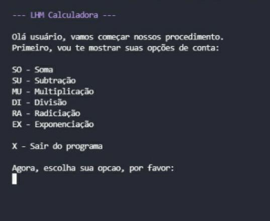
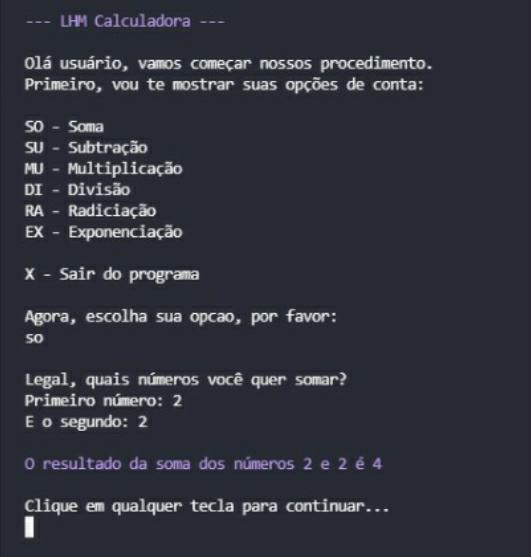
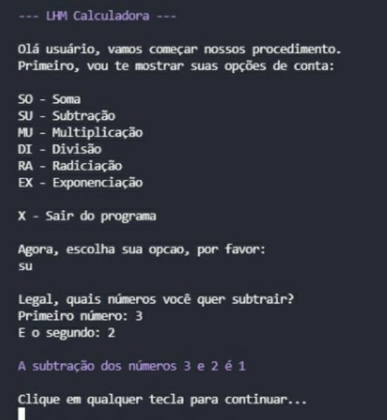
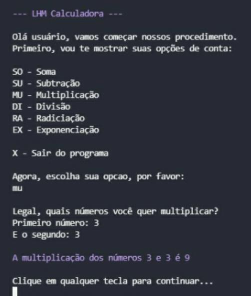
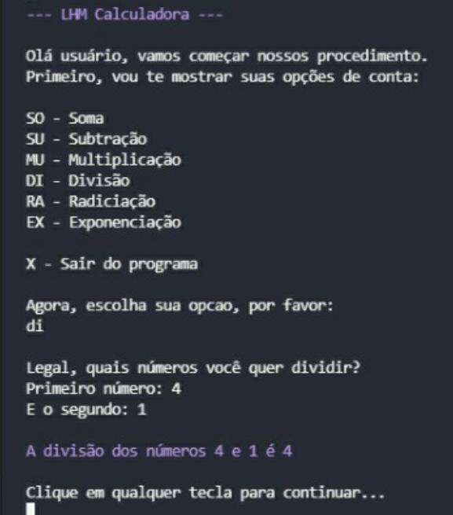
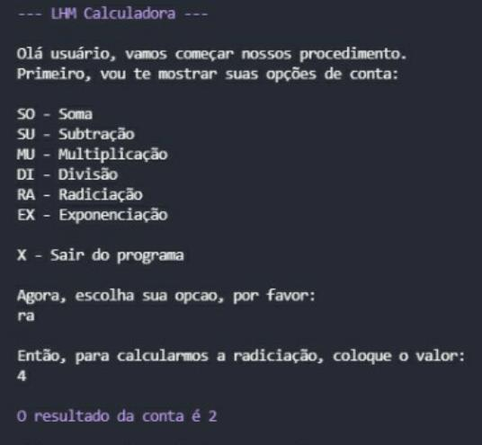
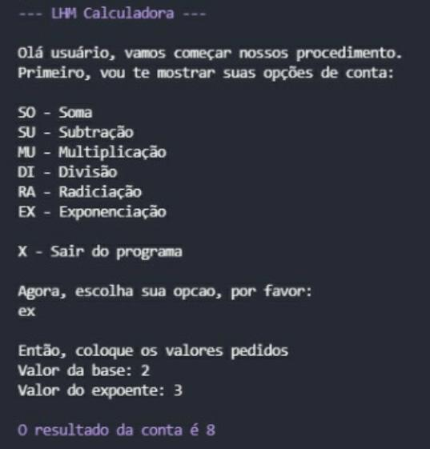
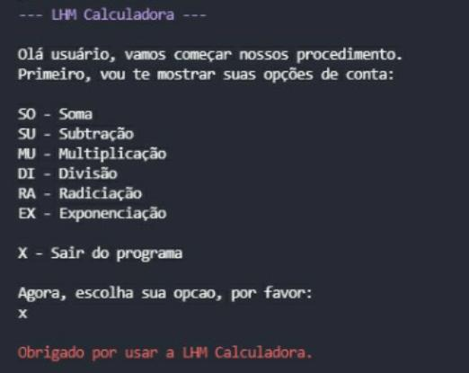

# Projeto Prático

## Manual do usuário

A LHM Calculadoras é a mais nova rede de calculadoras para estudantes do ensino fundamental e médio. Funciona assim: O usuário escolhe qual funcionalidade ele deseja executar (opções: soma, multiplicação, subtração, divisão, radiciação e exponenciação), após escolher ele coloca os valores pedidos, e executa a conta. Também existe a função de sair do programa. Conforma exemplos abaixo:

## Menu principal:

## Exemplo da função soma:

## Exemplo da função subtração:

## Exemplo da função multiplicação: 

## Exemplo da função dividir:

## Exemplo da função radiciação:

## Exemplo da função exponenciação:

## Exemplo da função sair do programa:

## Download

⏬ [Download do programa](https://github.com/LuizHenriqueMenezes/projetoPratico/raw/main/dist/projetoPratico.zip).

## Créditos 

Feito na [ETEC Adolpho Berezin](http://eteab.com.br).

